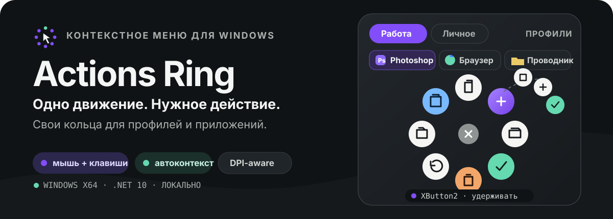
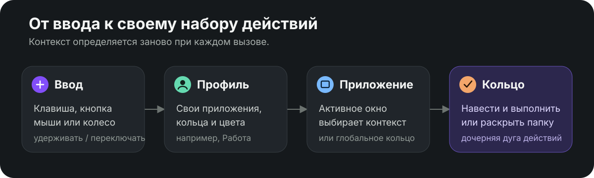

<p align="center">
  
</p>

<p align="center">
  <a href="https://github.com/perf769/actions-ring/releases/latest"><strong>Скачать последнюю версию</strong></a>
  &nbsp;&nbsp;·&nbsp;&nbsp;
  <a href="https://github.com/perf769/actions-ring">Исходный код</a>
</p>

<p align="center">
  <code>Windows x64</code>&nbsp;&nbsp;·&nbsp;&nbsp;<code>WPF</code>&nbsp;&nbsp;·&nbsp;&nbsp;<code>.NET 10</code>&nbsp;&nbsp;·&nbsp;&nbsp;работает локально
</p>

## Команды всегда рядом с курсором

Actions Ring показывает радиальное меню поверх активного приложения. Вызовите его кнопкой мыши или клавишей, наведитесь на нужный пузырь и отпустите кнопку — команда выполнится в том окне, где вы работали.

- Несколько пользовательских профилей: у каждого свои приложения, кольца и оформление.
- Отдельные контексты для программ с автоматическим выбором по активному окну.
- Поиск установленных классических и Microsoft Store-приложений, включая записи из `AppsFolder`.
- Контекстные наборы команд для Adobe Photoshop, браузеров и Проводника.
- Четыре–восемь действий в основном кольце и папки-подменю до девяти действий.
- Общая палитра кольца и индивидуальные цвета каждого пузыря, наведения и иконки.
- Адаптивный размер с учётом рабочего пространства и DPI монитора под указателем.

## Как выбирается кольцо

<p align="center">
  
</p>

Сначала используется выбранный пользовательский профиль. Внутри него Actions Ring сопоставляет активное окно с контекстами приложений по имени процесса, пути к программе или заголовку окна. Если совпадений нет, открывается глобальное кольцо этого же профиля.

## Быстрый старт

Готовая сборка самодостаточна: устанавливать .NET на целевой компьютер не нужно.

1. Откройте [последний релиз](https://github.com/perf769/actions-ring/releases/latest) и скачайте `ActionsRing-portable.zip`.
2. Распакуйте архив и запустите `ActionsRing.exe` либо установите программу для текущего пользователя:

   ```powershell
   powershell.exe -NoProfile -ExecutionPolicy Bypass -File .\Install.ps1
   ```

3. Пройдите короткую первоначальную настройку и назначьте удобный способ вызова.

Программа устанавливается без прав администратора в `%LOCALAPPDATA%\Programs\ActionsRing`. Удалить её можно через Windows «Установленные приложения» или скриптом `Uninstall.ps1`.

## Профили и приложения

Пользовательский профиль — самостоятельное рабочее пространство. Например, в профиле «Работа» можно собрать кольца для Photoshop, браузера и Проводника, а в профиле «Личное» оставить другой набор приложений и команд.

При добавлении контекста можно:

- выбрать найденное приложение из каталога Windows;
- использовать приложение Microsoft Store без поиска скрытого исполняемого файла;
- добавить текущее активное окно;
- указать программу вручную.

Для каждого добавленного приложения создаётся точное правило сопоставления; если совпало несколько контекстов, используется контекст с более высоким приоритетом.

В карточках приложений и действиях запуска используются иконки самих программ. Для веб-ссылок Actions Ring загружает и сохраняет фавикон сайта.

## Действия и подменю

Библиотека разделяет общие и контекстные команды. При настройке кольца Photoshop в ней появляются инструменты вроде кисти, пипетки, выделения и масштаба; для браузеров — вкладки, адресная строка и обновление; для Проводника — папки, поиск, свойства и представление.

Кроме готовых команд доступны:

- сочетания и последовательности клавиш;
- ввод текста;
- запуск приложений, файлов, папок и веб-ссылок;
- системные, оконные, медиа- и мышиные действия;
- регулировка громкости, яркости, масштаба и прокрутки колесом;
- папка, которая раскрывает отдельную дугу дочерних пузырей;
- мульти-действие из нескольких шагов с задержками.

Кнопка «По умолчанию» восстанавливает исходный набор пузырей выбранного кольца.

## Вызов и управление

По умолчанию кольцо назначено на дальнюю боковую кнопку мыши — `XButton2`. В настройках можно записать другую клавишу клавиатуры, сочетание с `Ctrl`/`Shift`, левую, правую, среднюю или боковую кнопку мыши, а также вертикальное и горизонтальное колесо.

Доступны два режима:

- **Удерживать** — кольцо открыто, пока нажата назначенная кнопка.
- **Переключать** — первое нажатие открывает кольцо, повторное закрывает.

Одиночные `Alt` и клавиши Windows можно назначить отдельно. Сочетания с ними не назначаются на вызов кольца, чтобы не пересекаться с системными меню; внутри действий эти модификаторы доступны.

## Оформление и движение

Внешний вид можно выбрать из готовых стилей или собрать собственную палитру в RGB/HEX-редакторе. Отдельно настраиваются фон пузыря, состояние наведения, цвет иконки и цвет иконки при наведении — для всего кольца либо для конкретного действия.

Предпросмотр в редакторе остаётся компактным и стабильным. Реальное кольцо масштабируется отдельно для монитора под курсором, учитывая его разрешение, рабочую область и DPI.

Параметры движения работают по-разному:

- **Анимации** полностью включают или отключают переходы.
- **Уменьшение движения** сохраняет короткие плавные появления, но убирает заметное разлетание и масштабирование элементов.

Экранные индикаторы показывают состояние `Caps Lock`, `Num Lock` и `Scroll Lock` и плавно исчезают. Их можно отключить в общих настройках.

## Работа в Windows

Actions Ring сворачивается в системный трей и может запускаться вместе с Windows. Переключатель автозапуска регистрируется для текущего пользователя и отображается в «Автозагрузке приложений» Диспетчера задач.

Настройки сохраняются в `%LOCALAPPDATA%\ActionsRing\settings.json`. Конфигурацию можно экспортировать в JSON и импортировать обратно; при сохранении поддерживается резервная копия.

## Сборка из исходников

Понадобится [.NET SDK 10](https://dotnet.microsoft.com/download/dotnet/10.0). Из корня репозитория выполните:

```powershell
powershell.exe -NoProfile -ExecutionPolicy Bypass -File .\build\Build.ps1
```

Сценарий восстанавливает зависимости, собирает приложение, запускает тесты и создаёт самодостаточный single-file пакет `dist\ActionsRing-portable.zip` для `win-x64`.

Для отдельного запуска тестов:

```powershell
dotnet test .\ActionsRing.slnx
```

## Устройство проекта

```text
src/ActionsRing.Core              модель кольца, профили и конфигурация
src/ActionsRing.Platform.Windows  глобальный ввод и интеграция с Windows
src/ActionsRing.App               WPF-интерфейс, оверлей и системный трей
tests/                             модульные и визуальные проверки поведения
```

Actions Ring работает локально: профили, назначенные команды и настройки ввода не отправляются на внешние серверы. Сетевое обращение выполняется только при загрузке фавиконки для добавленной веб-ссылки.
